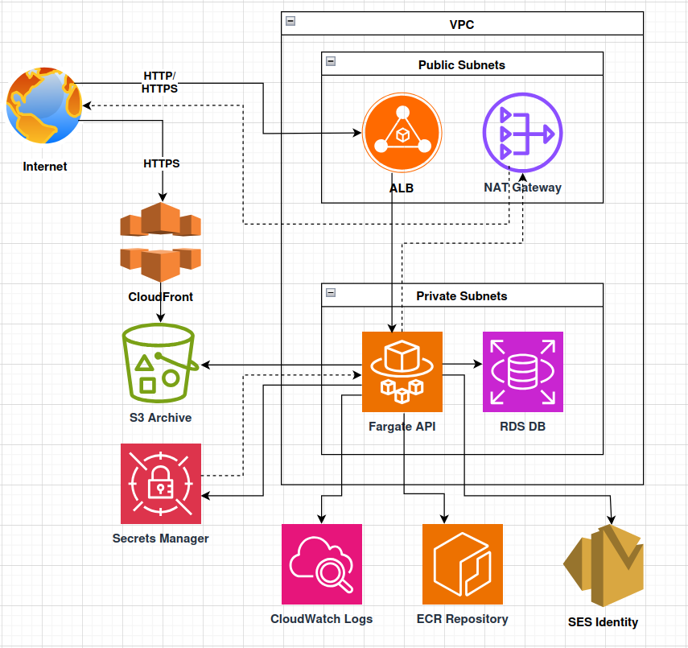

# Student Research Journal Infrastructure

Infrastructure-as-code for **Student Research Journal (SRJ)**, an open-access
platform for archiving and publishing supervised student research. The stack
provisions the AWS backend that hosts the Spring Boot API, PostgreSQL database,
file storage, and supporting services.

Written in **AWS CDK (TypeScript)** and deployed as a single CloudFormation
stack.

## Architecture



A user request enters the system through one of two public front doors - the
Application Load Balancer for API traffic, or CloudFront for file downloads.
Everything that runs your code lives inside a VPC, split into public subnets
(internet-facing) and private subnets (isolated). The Fargate service and RDS
database sit in the private subnets; access to the outside world happens
through the ALB (inbound) and the NAT gateway (outbound).

### Components, in request order

1. **Internet** the public network where users' browsers originate requests.
2. **CloudFront:** the CDN edge that caches and serves file downloads globally, forwarding cache misses to the private S3 bucket via Origin Access Control.
3. **ALB (Application Load Balancer):** the public entry point in the public subnets that receives all API traffic and forwards it to healthy Fargate tasks.
4. **VPC:** the private network boundary containing everything that runs your code, split into public and private subnets.
5. **Public Subnets:** the subnets that hold internet-facing resources (ALB, NAT Gateway) and have a route to the internet gateway.
6. **Private Subnets:** the isolated subnets that hold your workloads (Fargate, RDS), unreachable from the internet.
7. **Fargate API:** the serverless container service running the Spring Boot application, receiving requests from the ALB on port 8080.
8. **RDS DB:** the managed PostgreSQL 16 database that stores structured data (users, submissions, reviews), reachable only from the Fargate security group.
9. **Secrets Manager:** the encrypted store for the RDS master credentials that Fargate reads at container startup and injects as environment variables.
10. **S3 Archive:** the private bucket for PDFs and supplementary files, written to via presigned URLs and read through CloudFront.
11. **ECR Repository:** the private Docker registry that holds Spring Boot container images, which Fargate pulls at task startup.
12. **CloudWatch Logs:** the log aggregation service where every line the Spring Boot app writes to stdout is collected and retained.
13. **NAT Gateway:** the outbound-only gateway that lets private-subnet resources reach AWS APIs and the public internet without being reachable themselves.
14. **SES Identity:** the verified sender configuration that authorizes outbound transactional email (submission receipts, notifications) from the SRJ domain. *Deferred until a domain is registered.*

## Stack

Single stack: **`StudentResearchJournalStack`**. All resources are defined in
`lib/stacks/student-research-journal-stack.ts`.

## First-time setup

```bash
npm install
npx cdk bootstrap        # once per (account, region)
npm run synth            # verify the template synthesizes
npm run deploy           # deploy the stack
```

## Deploying the Spring Boot image

The stack creates an empty ECR repository. On the first deploy, Fargate cannot
pull an image that doesn't exist yet, so the deploy sequence is:

1. Temporarily set the task image to a placeholder:
```ts
   image: ContainerImage.fromRegistry('public.ecr.aws/docker/library/nginx:latest'),
```
2. `npm run deploy`: the stack creates the ECR repo alongside everything else.
3. Build and push the Spring Boot image (linux/arm64, see below):
```bash
   aws ecr get-login-password --region <region> \
     | docker login --username AWS --password-stdin <account>.dkr.ecr.<region>.amazonaws.com

   docker buildx build --platform linux/arm64 -t srj-api .
   docker tag srj-api:latest <account>.dkr.ecr.<region>.amazonaws.com/srj-api:latest
   docker push <account>.dkr.ecr.<region>.amazonaws.com/srj-api:latest
```
4. Switch the task image back to ECR:
```ts
   image: ContainerImage.fromEcrRepository(ecrRepository, 'latest'),
```
5. `npm run deploy`: Fargate replaces the placeholder tasks with the real API.

Subsequent deploys are just `docker push` + `aws ecs update-service --force-new-deployment`.

## Runtime platform

Fargate runs on **ARM64 (Graviton)** for ~20% lower compute cost than x86.
Container images must be built for `linux/arm64` — use `docker buildx` on x86
build hosts.

## Key design decisions

- **Single stack.** All resources in one stack for simplicity; will split if it grows unwieldy.
- **No env segment in resource names.** Each environment (when added) deploys to a separate AWS account, so names don't collide.
- **RDS in private subnets** with `deletionProtection: true` and `removalPolicy: RETAIN`. `cdk destroy` will not take the database with it.
- **S3 bucket is private.** Uploads use presigned URLs (Fargate never handles file bytes); downloads flow through CloudFront via Origin Access Control.
- **DB credentials in Secrets Manager.** Generated at deploy time, injected as env vars at container start, never visible in code or CloudFormation output.
- **IAM least privilege.** The Fargate task role can read/write exactly one bucket and read exactly one secret. Nothing else.

## Useful commands

```bash
npm run build           # type-check the TypeScript
npm run synth           # synth CloudFormation
npm run diff            # show changes before deploy
npm run deploy          # deploy the stack
npm run destroy         # tear down (RDS retains due to deletionProtection)
```

## Cost estimate

Roughly **$80–120/month** at idle load:

| Resource | Approx. cost |
|---|---|
| NAT gateway | ~$33 |
| ALB | ~$16 |
| RDS db.t3.small + 32 GB storage | ~$30 |
| Fargate (2 × 1024 CPU / 2048 MB, ARM64) | ~$25 |
| CloudFront, S3, Secrets Manager, ECR, logs | ~$5 |

Traffic-based costs (CloudFront data transfer, NAT processing, S3 requests) add
on top.

## Directory layout

```
srj-infra/
├── bin/
│   └── app.ts                                  # CDK app entry point
├── lib/
│   ├── config/
│   │   └── constants.ts                        # naming helpers, app name
│   └── stacks/
│       └── student-research-journal-stack.ts   # the whole stack
├── docs/
│   └── architecture.png                        # architecture diagram
├── cdk.json
├── package.json
├── tsconfig.json
└── README.md
```
